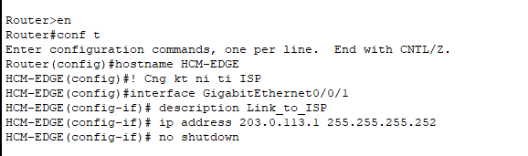

# Mục đích
Thư mục này sẽ chứa các file 
- báo cáo 
- Hình ảnh cấu hình thành công
- demo (nếu có)

## Quy tắc
Mỗi phần lệnh đã cấu hình xong phải có ảnh output đi kèm

Đặt tên file doc theo cú pháp 
<Cấu hình>_<Tên>_<Ngày upload>.doc (FILE WORD)

**TÊN FILE DOC PHẢI TRÙNG VỚI FILE .PKA TƯƠNG ỨNG**

VD: File IPConfig_NguyenHoangSon_3110.pka thì ở folder report này cũng phải có 1 file IPConfig_NguyenHoangSon_3110.doc


Ví dụ cấu hình xong, đã chạy được thì phải ghi ra lệnh +chụp màn hình lại ảnh đã chạy được phần đó 


**Lưu ý**: Vì trong 1 lần cấu hình, có thể có nhiều lệnh cấu hình và output đầu ra của lệnh đó, nên cần ghi rõ cấu hình phần nào:

VD: 

1.	Router HCM-EDGE

```bash
enable
configure terminal
hostname HCM-EDGE
! Cổng kết nối tới ISP
interface GigabitEthernet0/0/1
 description Link_to_ISP
 ip address 203.0.113.1 255.255.255.252
 no shutdown
```



